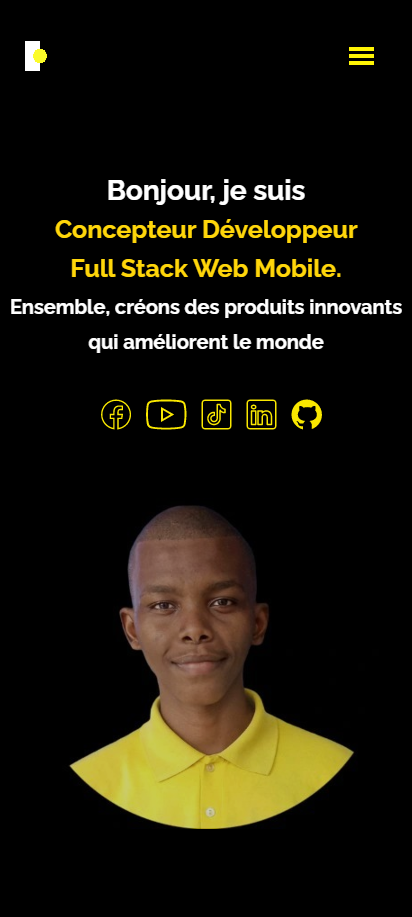
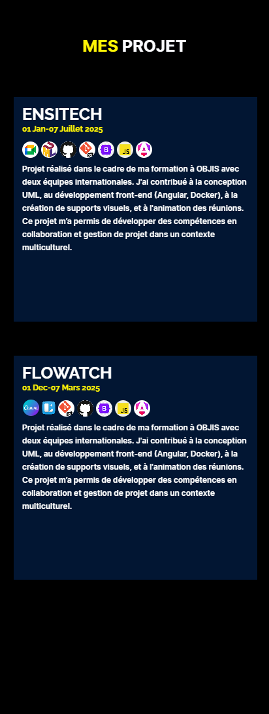
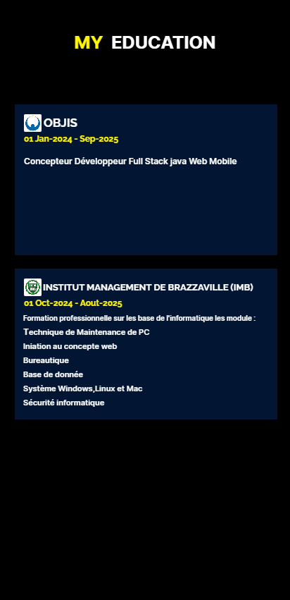

# 🌟 Portfolio Personnel - [NSENGIMANA François]

Bienvenue sur mon portfolio ! Ce projet a été conçu pour présenter mes compétences, mes projets, et mon parcours en tant que développeur Full Stack. Explorez mes travaux et n'hésitez pas à me contacter pour discuter d'opportunités ou de collaborations. 🚀

## 🌐 Accès au Portfolio  
👉 [Visitez mon portfolio en ligne ici](https://imana47.github.io/Nsengimana-François/)  

---

##  Fonctionnalités  
- **À propos de moi** : Découvrez qui je suis et ce qui me motive dans le monde du numérique.  
- **Projets** : Une vitrine de mes réalisations, accompagnée de descriptions et de démos.  
- **Compétences** : Technologies et outils que je maîtrise pour développer des solutions innovantes.
- **Education** : Connaitre mon parcours académique.  
- **Contact** : Une section dédiée pour me joindre facilement.  

---
## Interface Utilisateur
### Mobile       
<div  style="width: 100%;">
   <ul style="list-style: none;display: flex;gap:1.5rem;">
      <li> <b>Acceuill</b>
      
      </li>
      <li>
         <b>A propos</b>
      
      </li>
            <li>
      <b>Projet</b>
      
      </li>
      <li>
      <b>Education</b>
      
      </li>
      
   </ul>
   
</div>


### Tablette


### Desktop


## Technologies utilisées  
- **Frontend** : HTML5, CSS3, JavaScript  
- **UI/UX** : LUNACY  
- **Autres outils** : GitHub Pages pour l'hébergement  

---

## Exécution locale  
Vous pouvez cloner ce projet et l'exécuter localement pour voir comment il fonctionne.  

1. Clonez ce dépôt :  
   ```bash
   git clone https://github.com/IMANA47/Nsengimana-François.git
## 📞 Me contacter  

Vous avez une question ou souhaitez collaborer ? Je serais ravi d'échanger avec vous !  

- **📧 Email** : [imanatech47@gmail.com](mailto:imanatech47@gmail.com)  
- **💼 LinkedIn** : [François Nsengimana](https://www.linkedin.com/in/françois-nsengimana)  
- **YouTube** : [IMANA47](https://www.youtube.com/@IMANA47)
- **TikTok** : [imana.47](https://www.tiktok.com/@imana.47?is_from_webapp=1&sender_device=pc)  

N'hésitez pas à me contacter, je suis ouvert à toutes les opportunités et collaborations. À bientôt ! 😊  
